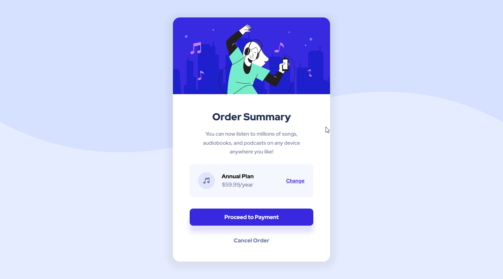

# Frontend Mentor - Order summary component solution

This is a solution to the [NFT preview card component challenge on Frontend Mentor](https://www.frontendmentor.io/challenges/nft-preview-card-component-SbdUL_w0U). Frontend Mentor challenges help you improve your coding skills by building realistic projects. 

## Table of contents

- [Overview](#overview)
  - [Screenshot](#screenshot)
  - [Links](#links)
- [My process](#my-process)
  - [Built with](#built-with)
  - [What I learned](#what-i-learned)
  - [Continued development](#continued-development)
- [Author](#author)

## Overview

### Screenshot

### Links

- Live Site URL: [Order summary component](https://order-summary-component.dodeun.com/)

## My process

### Built with

- Semantic HTML5 markup
- CSS custom properties
- SASS
- Flexbox
- Mobile-first workflow

### What I learned

Discovered the use of lighten() and darken()

Started to undertand better how to use background-image especially with SVGs.

### Continued development

The positioning of the "Change" link was annoying. The next time I am faced with a similar situation I will have to find a better way to do it.

Continue my learning on how to create and manipulate SVGs to add cool shapes on future designs.

I want to learn how to modify width based on screen width in a way that for exemple: The element must be at least 200px wide , and maximum 400px wide but is able to range between 200 and 400px.

## Author

- Frontend Mentor - [@Dodeun](https://www.frontendmentor.io/profile/Dodeun)